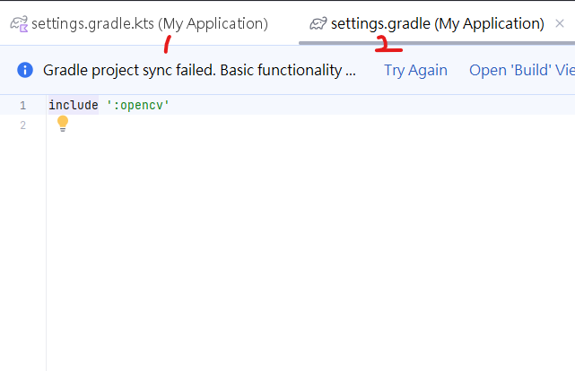
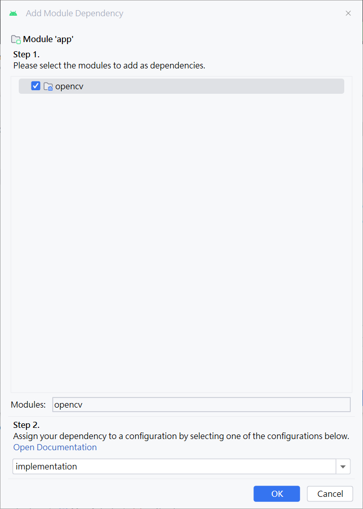
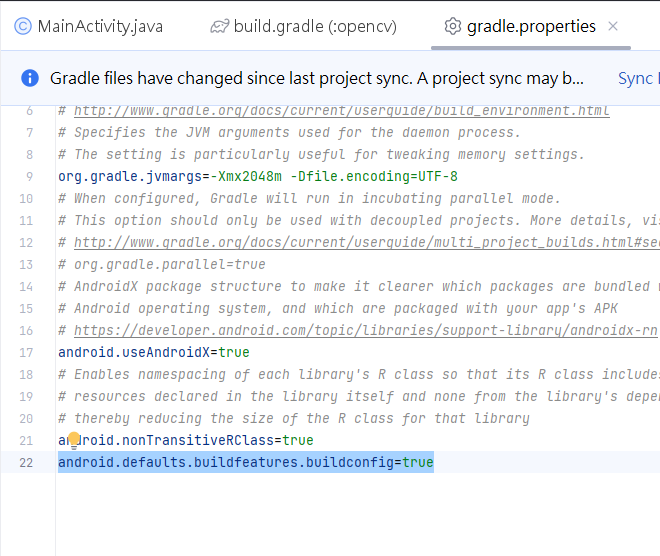

## 在Android Studio 2022.3.1.21上配置OpenCV for Android

Android Studio是一個功能強大的開發環境，但在新版本中引入OpenCV可能會面臨一些困難。本文旨在提供一個詳盡的指南，以協助您在Android Studio 2022.3.1.21上成功配置OpenCV for Android。

### 新建項目

1. 打開你的Android Studio並點擊"New Project"。

   

2. 選擇新建一個"Empty Views Activity"專案。

   

3. 配置如下圖所示：

   

4. 完成後按下"Finish"等待專案建置。

5. 進入Android Studio後，運行一次確保Hello World程式可以運行（這裡是模擬器測試）。

   

### 下載OpenCV for Android

1. 請前往OpenCV的官方網站 [下載OpenCV](https://opencv.org/releases/) for Android。解壓縮下載的檔案，您將會得到一個名為`opencv-android-sdk`的資料夾。

   

2. 解壓縮後資料夾主要包含一個`sdk`資料夾，其中包含`build.gradle`文件。

   
   
   
4. 確認好這些文件都齊全後就可以開始建置android studio 專案了

### 導入OpenCV模組

1. 點擊"File" >> "New" >> "Import Module"，點開後選擇`opencv-android-sdk`資料夾當中的sdk資料夾，並且命名模組為:opencv
   
   
   
2.導入模組後可能會出現以下錯誤訊息：`Plugin [id: 'com.android.application', version: '8.1.4', apply: false] was not found in any of the following sources.`

   

1.  解決問題，修改版，本開啟`build.gradle`文件，確保版本一致。
   
   
   
   
   

2. 添加namespace，將`apply plugin: 'kotlin-android'`註釋掉，添加`namespace "org.opencv"`。

   

3. 添加`settings.gradle`內容，將其內容複製到`settings.gradle`。

   
   
   

   複製後應如下：

   

4. 再次編譯代碼，確保不再出現錯誤訊息。

   

   再次運行手機APP，確保正常顯示。

   
   

### 應用OpenCV到APP當中

1. 點選"File" >> "Project structure" >> "Dependencies" >> "app" >> "3 Module Dependency"。

   
   

   點擊"Apply"然後"OK"。

   

2. 解決問題2：找不到 `import org.opencv.engine.OpenCVEngineInterface`。

   - 新建一個路徑`aidl/org/opencv/engine`。
   - 將`OpenCVEngineInterface.aidl`文件放在這個路徑下。

   

3. 在`build.gradle (:opencv)`中添加以下程式碼：

   ```gradle
   buildFeatures {
       aidl true
   }


4. 在`gradle.properties`中添加以下程式碼：

   ```
   android.defaults.buildfeatures.buildconfig=true



程式碼運行成功!


```python

```
