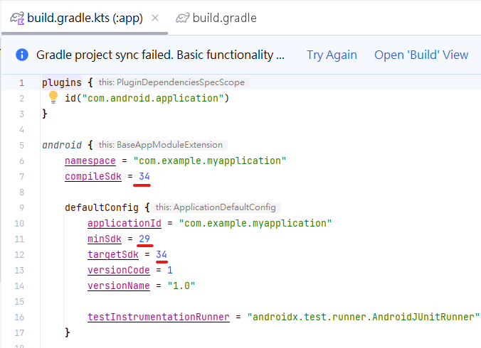
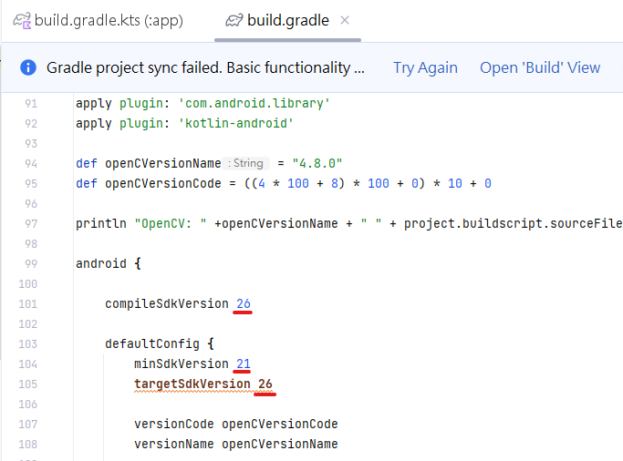
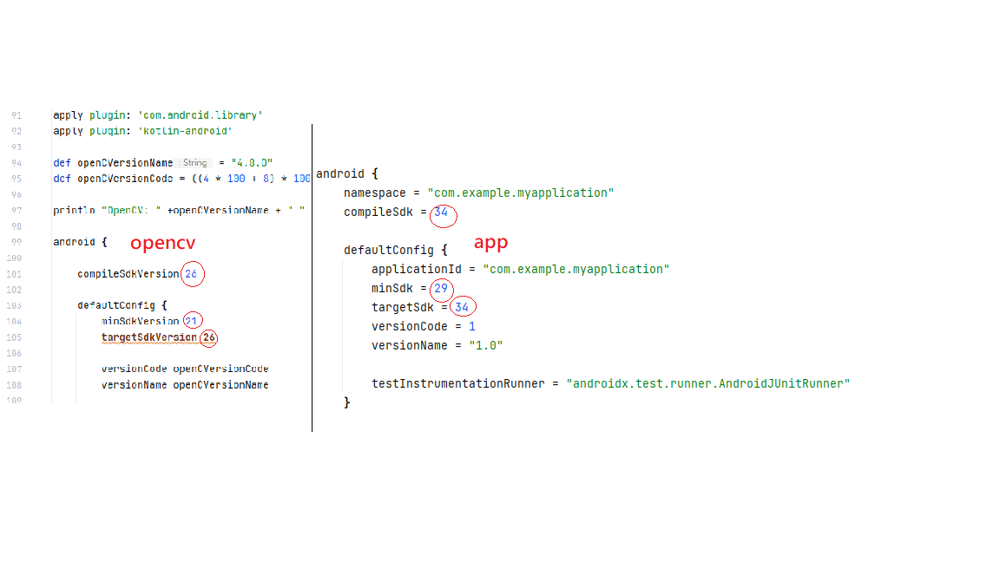
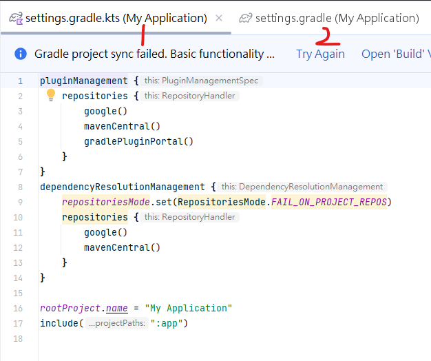
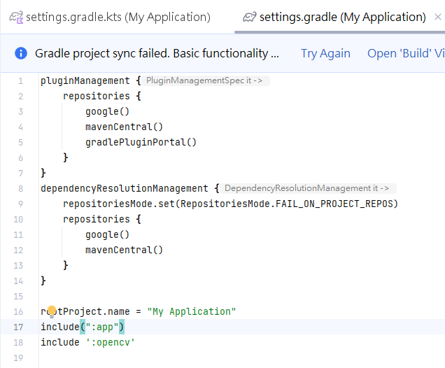

## 在Android Studio 2022.3.1.21上配置OpenCV for Android
Android Studio是一個功能強大的開發環境，但在新版本中引入OpenCV可能會面臨一些困難。本文旨在提供一個詳盡的指南，以協助您在Android Studio 2022.3.1.21上成功配置OpenCV for Android。

## 新建項目

打開你的Android Studio並且點擊New Project


新建一個Empty Views Activity 專案


配置如下圖


好了之後按下Finish等待專案建置

進入Android Studio之後請運行一次確保Hello World 程式可以運行(這裡是模擬器測試)


## 下載OpenCV for Android
首先，請前往OpenCV的官方網站[下載OpenCV](https://opencv.org/releases/)for Android。解壓縮下載的檔案，您將會得到一個名為opencv-android-sdk的資料夾。

本文使用OpenCV 4.8.0 版本


下載好了之後會有一個壓縮包如下圖


解壓縮完成後資料夾當中主要會這個sdk資料夾


sdk資料夾點開後應該會有一個build.gradle的文件


確認好這些文件都齊全後就可以開始建置android studio 專案了

### 導入OpenCV模組
點擊File >> New >> Import Module，點開後選擇opencv-android-sdk資料夾當中的sdk資料夾，並且命名模組為:opencv


導入模組後可能會出現以下錯誤訊息：Plugin [id: 'com.android.application', version: '8.1.4', apply: false] was not found in any of the following sources.


### 解決問題1：
## 修改版本
開啟opencv資料夾底下的build.gradle文件，修改版本，版本要與app的build.gradle的一致。






## 添加namespace
將 `apply plugin: 'kotlin-android'` 這行進行註釋，並添加這行 `namespace "org.opencv"`


## 添加settings.gradle內容
將settings.gradle.kts的內容複製到settings.gradle當中(也就是把圖片中的1複製到2)





複製好之後會像這樣



## 再次編譯代碼
再次編譯代碼之後就不應該再出現錯誤訊息。


再次運行手機APP正常顯示


## 應用OpenCV到APP當中
首先點選File>>Project structure>>Dependencies>>app>>3 Module Dependency


先按下apply在按下ok


編譯時不會出現問題，導出到app上會出現問題


### 解決問題2：
找不到 import org.opencv.engine.OpenCVEngineInterface;
因為aidl的路徑與Android默認的不同，所以新建一個路徑aidl/org/opencv/engine
然後把OpenCVEngineInterface的檔案放在這個路徑底下


## build.gradle (:opencv)

在 build.gradle (:opencv) 中添加以下程式碼

buildFeatures{
    aidl true
}


## gradle.properties

在gradle.properties中添加程式碼
android.defaults.buildfeatures.buildconfig=true


程式碼運行成功!


```python

```
